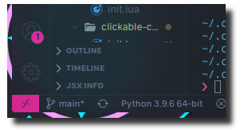

# awesomwm

## Work In Progress

This configuration is being adapted from the TDE, which is essentially an over complicated AwesomeWM configuration for another Arch variant called [TomOS](https://tos.odex.be/) (**no relation**).
I am modifying the source code of that repo rather intensely, making it suit my purposes and arranging it in a more useful albeit less snazzy, format for inclusion within the Electric
Tantra Linux. Due to the original form's basis being derived from the 'Glorious Dotfiles', another questionably named giant in Awesome WM configurations, a lot of the baggage from that repo's
idiosyncracies is making for a complicated and painful adaptation process that requires I use a version control else have to restart more often than I can tolerate.

## "What's With All the Comment Blocks"

Each file that I have either written myself or modified so heavily as to essentially be my own work, even if in the sense that the monster was Dr. Frankenstein's,follows a specific layout. **This is because otherwise these files can be hard to read and the comment blocks help to parse the file into appreciable chunks**. See the documentation for an example screenshot with a more detailed explanation but essentially the files follow the following format:

- ASCII Art File Name Occupying 3 Lines 
- Three line comment bar
- `require` statements pulling in necessary modules
- three line comment bar
- function, section or other meaningful chunk
- three line comment bar 
- [several more chunks followed by comment bars]
- return statement 

Which you may think is a little over zealous or I chop things up in a way that doesn't help you,which is fine. I suggest you do at least something like this for your own understanding of what is going on in the code and keeping things neat and tidy in your own configuration according to your own methodology.

## Work in Progress

There is still a lot left to do with this configuration, not the least of which involves detangling some of the configurations (undecided on if I want to totally remove the settings application modal, since the only one that is useful)

## Gallery

